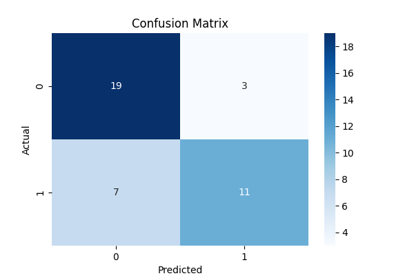

# fraud_detection_poc

## Table of Contents

1. [Project Structure](#project-structure)  
2. [Getting Started](#getting-started)  
   - [Setting Up a Local Environment](#setting-up-a-local-environment)  
   - [Running the Application](#running-the-application)  
   - [Running Tests](#running-tests)  
3. [Model Results](#model-results)  
   - [Baseline: Logistic Regression](#baseline-logistic-regression)  
   - [SVM Results](#svm-results)  
   - [BERT Results](#bert-results)


## Project Structure

```
fraud_detection_poc/
├── .pytest_cache/         # Cache for pytest (ignored in version control)
├── data/                  # Contains raw and processed data
│   └── raw/               # Raw data files (e.g., Scam_Not_scam.csv)
├── env/                   # Virtual environment directory (ignored in version control)
├── logs/                  # Logs generated during training and testing
├── notebooks/             # Jupyter Notebooks for exploratory data analysis (EDA) and preprocessing
│   └── EDA_and_Preprocess.ipynb  # Notebook for initial EDA and data preprocessing
├── outputs/               # Output directory for experiment results
│   ├── baseline/          # Results for Logistic Regression baseline model
│   ├── svm/               # Results for SVM model
│   └── bert/              # Results for BERT model
├── src/                   # Source code for project
│   ├── __init__.py        # Makes folder a Python package
│   ├── bert_model.py      # Functions for training and evaluating BERT model
│   ├── feature_engineering.py  # Functions for feature engineering (e.g., TF-IDF)
│   ├── main.py            # Main entry point for running models
│   ├── model.py           # Functions for training and evaluating ML models (e.g., Logistic Regression, SVM)
│   ├── preprocess.py      # Preprocessing functions for text cleaning
│   └── utils.py           # Utility functions for saving outputs and metrics
├── tests/                 # Unit tests for project
│   ├── test_bert_model.py # Tests for BERT-related functionality
│   ├── test_model.py      # Tests for ML models
│   └── test_preprocess.py # Tests for text preprocessing functions
├── .gitignore             # Specifies files and directories to ignore in version control
├── README.md              # Documentation and instructions for  project
├── requirements.txt       # List of required Python packages
```

- `data/`: Contains all input data files. raw/ subdirectory stores unprocessed data, such as dataset used for classification.

- `notebooks/`: Includes Jupyter Notebooks for exploratory analysis.

- `outputs/`: Stores results of model training and evaluation, such as confusion matrices, classification reports and metrics for each experiment (baseline, SVM, BERT).

- `src/`: Contains all core Python modules for preprocessing, feature engineering, model training, and utility functions.

- `tests/`: Unit tests for verifying individual components of codebase.

- `.gitignore`: Ensures sensitive or unnecessary files (e.g., virtual environments, cache files) are excluded from version control.

- `requirements.txt`: Contains all dependencies needed to run project

## Getting Started

  

### Setting Up a Local Environment

To set up a local development environment, follow these steps:


1.  **Clone the Repository**

```bash
git clone https://github.com/VPLEV23/

cd fraud_detection_poc
```
-  **Create a Virtual Environment** (Optional, but recommended)
	- For Windows:
	```bash
	python -m venv venv 
	
	.\venv\Scripts\activate
	```
	- For macOS and Linux:
	```bash
	python3 -m venv venv
	
   source venv/bin/activate
	```
2. **Install Dependencies**
```bash 
pip install -r requirements.txt
```
### Running the Application

**Note: Run all comads from root directory of the project !!!!**

```bash 
python src/main.py
```

### Running Tests

Execute the following command to run unit tests:
```bash 
pytest
```

## Model Results

### Baseline: Logistic Regression

#### Evaluation Metrics

| Metric            | Class 0 (Acceptable) | Class 1 (Unacceptable) | Overall |
|--------------------|----------------------|-------------------------|---------|
| Precision          | 0.73                | 0.79                   | 0.76    |
| Recall             | 0.86                | 0.61                   | 0.75    |
| F1-Score           | 0.79                | 0.69                   | 0.74    |
| Accuracy           | -                   | -                      | 0.75    |


#### Confusion Matrix
Confusion matrix provides insights into model's performance for each class:


---

#### Observations:

- Model performs well on detecting **Class 0** (acceptable content) with high precision and recall.
- It struggles more with **Class 1** (unacceptable content), as seen in lower recall (0.61). This indicates that some unacceptable cases were missed.
- Overall accuracy of **75%** is a good starting point for a baseline, with room for improvement using more complex models like SVM or BERT.

### Support Vector Machine (SVM)

#### Evaluation Metrics

| Metric            | Class 0 (Acceptable) | Class 1 (Unacceptable) | Overall |
|--------------------|----------------------|-------------------------|---------|
| Precision          | 0.73                | 0.79                   | 0.76    |
| Recall             | 0.86                | 0.61                   | 0.75    |
| F1-Score           | 0.79                | 0.69                   | 0.74    |
| Accuracy           | -                   | -                      | 0.75    |

#### Confusion Matrix
Confusion matrix provides insights into model's performance for each class:


---
#### Observations

- Similar to Logistic Regression model, SVM model performs well for **Class 0 (acceptable content)** with higher precision and recall.
- **Class 1 (unacceptable content)** has a slightly lower recall (0.61) indicating room for improvement in identifying unacceptable content.
- Overall accuracy of **75%** matches baseline Logistic Regression model showcasing a consistent performance.

### BERT

#### Evaluation Metrics

| Metric               | Value     |
|-----------------------|-----------|
| Loss                 | 0.4708    |
| Accuracy             | 0.825     |
| Precision            | 0.8249    |
| Recall               | 0.825     |
| F1-Score             | 0.8244    |
| Evaluation Runtime   | 1.688s    |
| Samples per Second   | 23.697    |
| Steps per Second     | 1.777     |

#### Observations

- **Accuracy**: BERT model achieves **82.5% accuracy** outperforming both Logistic Regression and SVM.
- **Precision and Recall**: Both metrics are closely aligned indicating a balanced performance for both classes.
- **F1-Score**:F1-Score of **0.8244** demonstrates model's strong overall performance in classifying acceptable and unacceptable content.
- **Loss**: Evaluation loss of **0.4708** shows that  model is well-optimized.

